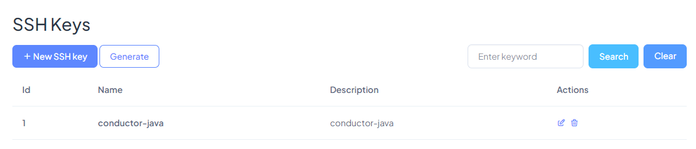

## Generate an SSH Key

Go to the menu option `SSH Keys`.

When connecting with a cloud service provider, you will have to provide an SSH key, from the application that connects to them, in our case **STARTcloud**, therefore, if you don't have an SSH Key, press the `Generate` button so that we create one automatically for you.

For now you should not use this SSH Key. Later you will have to select it from a list of available SSH keys (When you are setting the necessary configuration variables before launching a new instance from **STARTcloud**).

