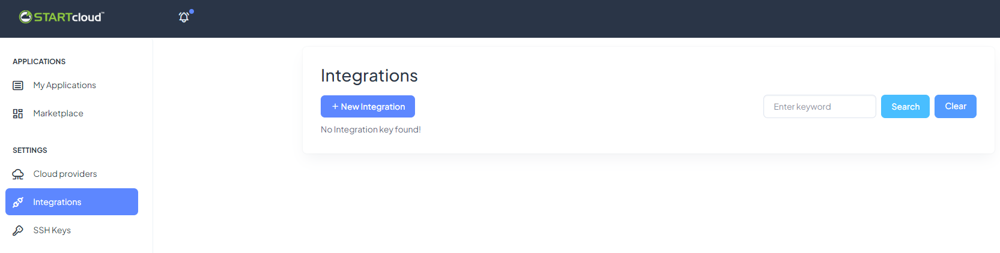
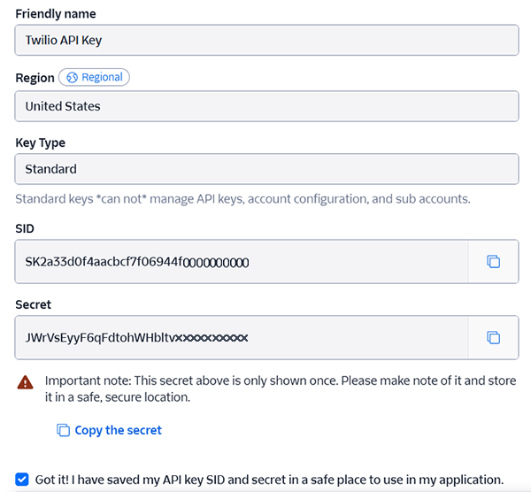
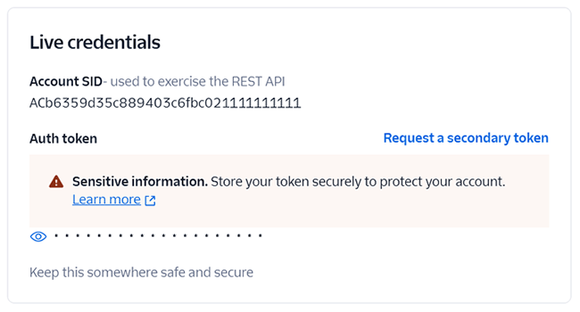
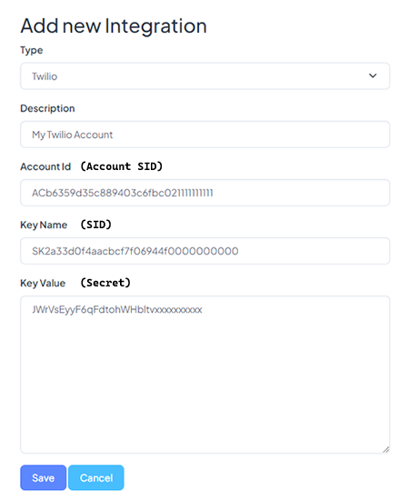
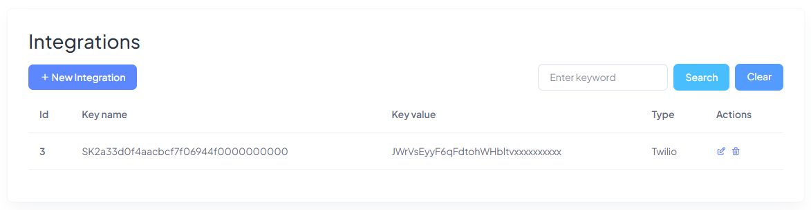

## Twilio

**Switchboard Cloud™** uses **Twilio** to connect your calls. You’ll create your **Twilio** account after signing up for **STARTcloud™**, and before deploying a new instance of **Switchboard Cloud™**.

Once you have logged into your STARcloud account, go to the `Integrations` menu option and click `New Integration`.

In a new browser tab, sign in to your **Twilio** account. If you don't have an account yet, create a new one by following this [link](https://login.twilio.com/u/signup) and click `Sign Up`.

After completing the registration process, go to `Account` -> `API Keys & Tokens` -> `Create API Key`.

Set a **Friendly name**, choose a **Region** and a **Key Type**; then click `Create`. Here the application will display a **SID** and a **Secret**. Make sure to copy these 2 values, the **SID** will be the **Key Name** (in the Twilio integration) and the **Secret** will be the **Key Value**. Note that the **Secret** _is only revealed once_, so you should save it in a safe location.

  

- Copy the **SID** and paste it in the first tab you had, the **STARTcloud™** one, under **Key Name**.
- Copy the **Secret** and paste it into the **Key Value**.

Then click `Done`.

Finally, to find the **Account Id**, go back to `Account` -> `API Keys & Tokens` and scroll to the bottom. Copy the **Account SID** in the _Live credentials_ section.

  

Now that you have all the necessary values to create the integration in **STARTcloud™**, press `Save` and the process is complete.

  

You'll see the integration you just created in the list of integrations.

