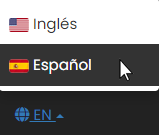

## Internationalization

The application is also available in Spanish, therefore according to your region, or your preferred language, you can change the language of the application, in the EN menu option.

**Switchboard Cloud™** is prepared to easily add a new language, so that it can work for different regions.

  

