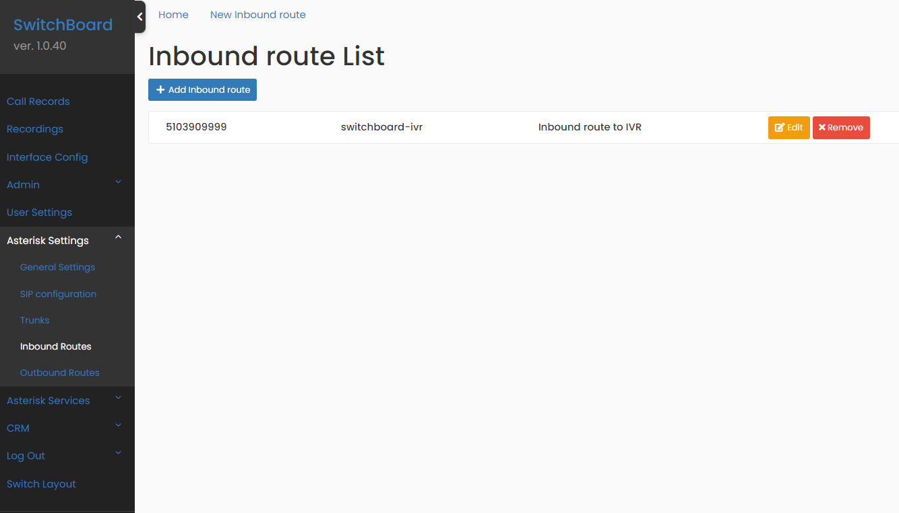
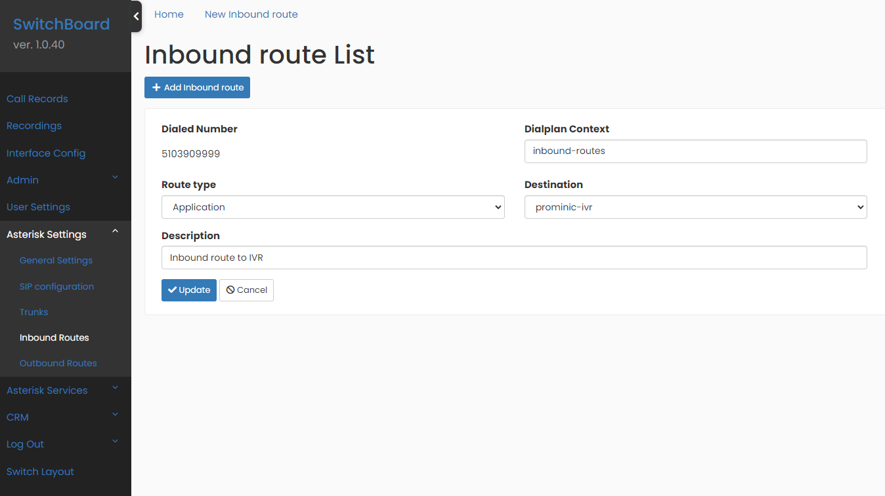
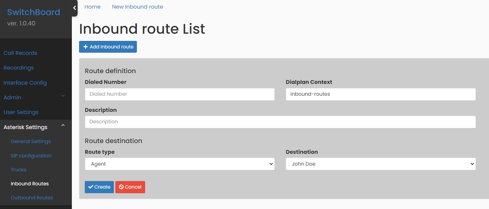

## Inbound Routes

The **Inbound routes** page is available only for administrator users, under the `Asterisk Settings` menu option. It allows you to configure which destination **Asterisk®** uses for inbound calls from **trunks**.

In this way, in the system you can easily specify what to do when you receive a call to one of your telephone numbers (which you previously purchased from your communication service provider). You can choose to route this call to:

1. An **Agent**.
2. A service **Queue** for your department, such as Sales or Support, where several agents simultaneously receive the call until one of them takes it.
3. Your phone system **IVR**, that "answering machine" that interacts with Users through the use of voice and **DTMF** tones input with a keypad.

 

