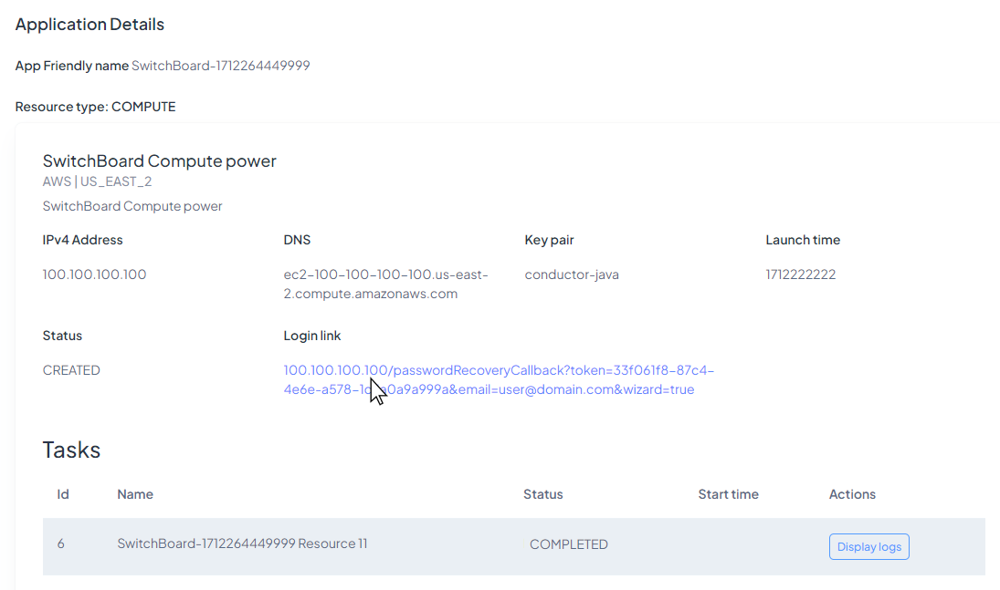
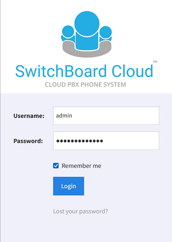

If you already have your own **Switchboard Cloud™** instance, your phone system is ready to be configured. Follow this guide to log in and start setting up your phone system from scratch so you can make and receive calls.

## Log in to the Phone Interface

You will find a link to enter your Phone Application when logging into **STARTcloud™** and going to `My Applications`. Select the application you want to open and click on the _Login link_.

Now you just have to log in and start using **Switchboard Cloud™**.

  

